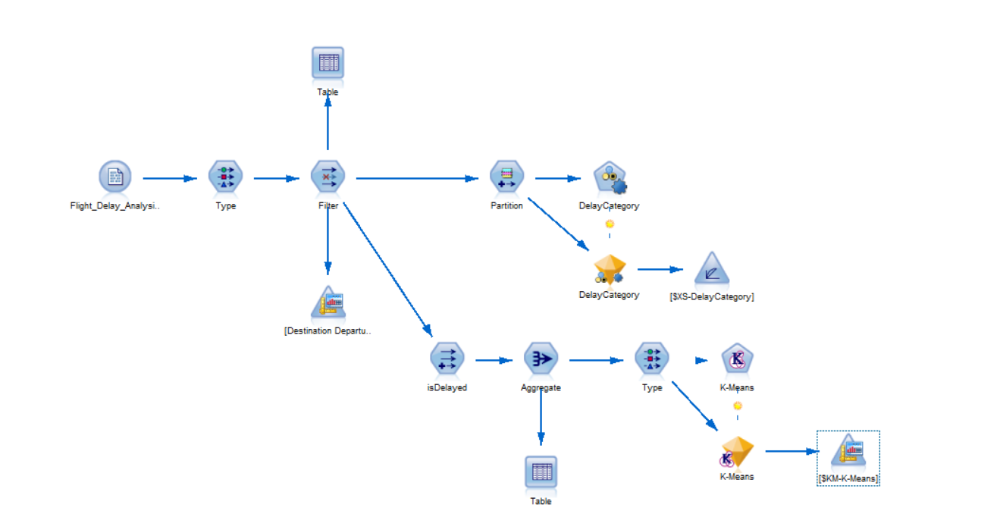

# ✈️ Flight Delay Analysis for Popular Destinations

## 📌 Project Overview
This project aims to analyze flight delays across popular travel destinations using **IBM SPSS Modeler**. By applying data transformation, aggregation, and clustering techniques, we extract meaningful insights from historical flight delay data to identify high-risk routes and suggest improvements.

---

## 🧠 Objectives
- Identify the frequency and causes of flight delays.
- Group destinations based on delay patterns using clustering.
- Provide actionable insights for airline and airport operations.
- Demonstrate data improvement and preprocessing for modeling.

---

## 🧰 Tools & Technologies
- **IBM SPSS Modeler**
- Dataset (CSV format) containing:
  - Flight Date
  - Carrier Code
  - Origin and Destination Airport
  - Scheduled and Actual Departure/Arrival Times
  - Delay Durations
  - Cancellation/Diverted Status

---

## 🧪 Methodology

### 1. **Data Preparation**
- Imported dataset containing flight records.
- Cleaned missing or irrelevant fields.
- Derived a new field `IsDelayed`:
  ```text
  If DepartureDelay > 15 mins → 1 (Delayed)
  Else → 0 (On Time)
  ```

### 2. Aggregation
Used Aggregate node to group by destination and calculate:

Average Departure Delay

Total Number of Flights

Total Delayed Flights

### 3. Clustering with K-Means
Applied a Type node to define numeric field types.

Used K-Means node to segment destinations into clusters based on delay trends.

### 📊 Output & Insights
The model clustered destinations into low, moderate, and high-delay groups.

Insights support route optimization, better resource allocation, and enhanced passenger satisfaction.

### ✅ Improvement Proof
Before: Raw flight data lacked actionable grouping.

After: Aggregated delay metrics and clustering revealed clear operational categories.

Demonstrates how preprocessing and modeling improve decision-making capability.

### Stream


### 🏁 Conclusion
Using SPSS Modeler, this project proves the effectiveness of data-driven modeling in understanding flight delays. With minimal code, we derived powerful insights to support real-world aviation planning.

